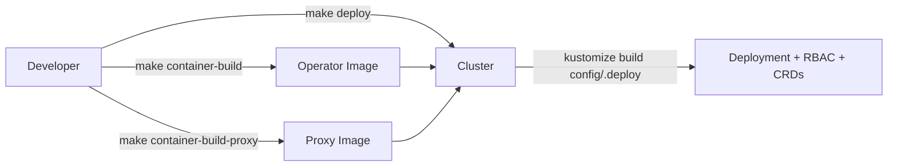
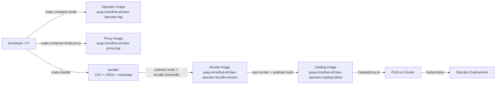

# ADR-0010: OLM Deployment Model

**Status:** Implemented
**Date:** 2026-05-18

## Overview

The claw-operator originally deployed via raw Kustomize (`make deploy` / `make dev-deploy`) with manually-managed image references. This decision migrates the production deployment model to OLM (Operator Lifecycle Manager), aligning with how the codeready-toolchain host-operator and member-operator are managed.

The migration adds:

- A ClusterServiceVersion (CSV) base for the operator
- A `make bundle` target using `operator-sdk generate bundle`
- Bundle and catalog image build/push pipeline via self-contained Makefile targets
- CI integration: static bundle validation on PRs, full CD pipeline on master push
- `relatedImages` support for all operator-managed images (manager, proxy, kubectl)
- Commit-count-based versioning with `staging` and `alpha` channels

## Design Principles

- **Toolchain alignment** — follow the same OLM patterns used by host-operator and member-operator so that all codeready-toolchain operators are managed consistently
- **Three-image operator** — the claw-operator manages three images (manager, proxy, kubectl); the CSV declares all three via `relatedImages` and the Deployment env vars `PROXY_IMAGE` and `KUBECTL_IMAGE`
- **Dev escape hatch** — retain `make dev-deploy` for rapid local iteration without OLM; OLM is the production deployment path
- **Self-contained** — all CD logic lives in the Makefile (no external toolchain-cicd dependency), tailored to the single-repo three-image model
- **Incremental adoption** — bundle generation and local validation come first, followed by CI/CD automation

## Architecture

### Current Deployment Flow



### Target OLM Deployment Flow



### Bundle Directory Structure

After running `make bundle`, the generated `bundle/` directory contains:

```
bundle/
├── manifests/
│   ├── claw-operator.clusterserviceversion.yaml
│   ├── claw-operator-controller-manager-metrics-service_v1_service.yaml
│   ├── claw.sandbox.redhat.com_claws.yaml
│   └── claw.sandbox.redhat.com_clawdevicepairingrequests.yaml
├── metadata/
│   └── annotations.yaml
├── tests/
│   └── scorecard/
│       └── config.yaml
```

RBAC resources and the Deployment are embedded in the CSV by `operator-sdk generate bundle`, not emitted as separate files.

The `bundle/` directory is **committed to the repo**. CI enforces consistency by running `make bundle && git diff --exit-code bundle/` to catch drift from the source in `config/`.

### CRD Inclusion Strategy

The existing `config/default/kustomization.yaml` excludes CRDs because `make deploy` installs them separately. For bundle generation, CRDs must be in the kustomize output, so `../crd` is added to `config/manifests/kustomization.yaml` — only the bundle generation path picks them up, without changing existing deployment behavior.

### Catalog Image Build Strategy

The catalog is **not committed to the repo** — it is built ephemerally during CD, matching the host-operator's approach. Each CD run:

1. Pulls the existing catalog image (if one exists)
2. Renders the previous catalog content via `opm render`
3. Renders the new bundle via `opm render`
4. Assembles the updated FBC (package + channel + bundle entries) into a temporary directory
5. Validates with `opm validate`
6. Builds and pushes the new catalog image

This avoids git commits back to master during CD (no git identity, protected branch, or race condition concerns). The `olm.skipRange` on the staging channel means only the latest bundle entry is needed for upgrades, keeping the catalog minimal.

FBC is the current OPM standard, replacing the deprecated SQLite-based `opm index add` approach. The ephemeral build strategy mirrors the host-operator's fire-and-forget CD model.

## Core Concepts

### ClusterServiceVersion (CSV)

The CSV declares:

- **Owned CRDs**: `Claw` and `ClawDevicePairingRequest`
- **Deployment spec**: single controller-manager container with `PROXY_IMAGE` and `KUBECTL_IMAGE` env vars
- **`relatedImages`**: all three operator-managed images (manager, proxy, kubectl), enabling disconnected/airgapped installs
- **Install modes**: `OwnNamespace: true`, `SingleNamespace: true`, `MultiNamespace: false`, `AllNamespaces: false`
- **Metadata**: display name, description, icon, maintainers, links, keywords, maturity level (`alpha`)

### `relatedImages`

The CSV declares all three operator-managed images in `spec.relatedImages`:

```yaml
spec:
  relatedImages:
    - name: manager
      image: REPLACE_IMAGE
    - name: proxy
      image: REPLACE_PROXY_IMAGE
    - name: kubectl
      image: REPLACE_KUBECTL_IMAGE
```

During CD, the Makefile replaces these placeholders with actual image references. `REPLACE_CREATED_AT` is substituted with the current UTC timestamp.

### Versioning

Commit-count-based, matching the toolchain pattern:

- **Format:** `0.0.<commit-count>-commit-<short-sha>` (e.g., `0.0.342-commit-a1b2c3d`)
- **`replaces`:** computed from `HEAD^` as `0.0.<commit-count - 1>-commit-<previous-sha>`
- **`olm.skipRange`:** `>=0.0.0 <current-version` on the staging channel for fast-forward upgrades

### Channels

- **`staging`** (default): auto-published on every master push, `olm.skipRange` for fast-forward
- **`alpha`**: manual publish via `make publish-current-bundle` (first-release mode, no `replaces`)

## Dev Workflow

The OLM deployment model is the production path. Daily development is unchanged:

1. **`make dev-deploy`** — raw Kustomize, no OLM. Fast iteration, no bundle generation needed.
2. **`make publish-current-bundle`** — available for testing the full OLM install path on a dev cluster with OLM installed.

## Decisions

| # | Question | Decision | Rationale |
|---|----------|----------|-----------|
| Q1 | Bundle directory | Committed with CI enforcement (`git diff --exit-code`) | Matches host-operator; reviewable in PRs with CI enforcing consistency |
| Q2 | CD scripts | Self-contained Makefile targets (no toolchain-cicd dependency) | Single-repo three-image model; all build logic in one place; no multi-repo complexity |
| Q3 | CI/CD design | Static bundle validation on PRs; full CD on master push | Fast PR feedback without image push; master always publishable |
| Q4 | Container file naming | `bundle.Dockerfile` (operator-sdk default) | Avoids fighting the tooling; matches toolchain-cicd expectations |
| Q5 | Install modes | `OwnNamespace + SingleNamespace` (matches host-operator) | Consistent with host-operator; RBAC controls actual watch scope |
| Q6 | Catalog image registry | `quay.io/redhat-et/claw-operator-catalog:latest` (ephemeral FBC) | Same registry org as the published claw-operator images; fire-and-forget CD model |
| Q7 | Versioning | Commit-count-based (`0.0.<count>-commit-<sha>`) | Automatic; matches toolchain pattern; deterministic `replaces` from `HEAD^` |
| Q8 | Channels | `staging` (auto, default) + `alpha` (manual) | Matches toolchain dual-channel setup; `stable` can be added later |
| Q9 | Scorecard in CI | Static validation in PRs; full scorecard in CD | Balance of speed (no cluster needed for PRs) and thoroughness (cluster in CD) |
| Q10 | Dev workflow | `make dev-deploy` unchanged; OLM is production-only | Zero friction for developers; OLM path tested in CI/CD |
