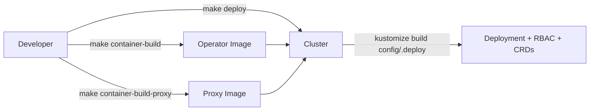
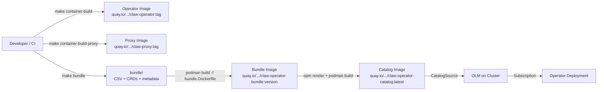

# OLM Deployment Model

**Status:** Final
**Decisions:** [olm-deployment-questions.md](olm-deployment-questions.md)

## Overview

The claw-operator currently deploys via raw Kustomize (`make deploy` / `make dev-deploy`) with manually-managed image references. This design migrates the production deployment model to OLM (Operator Lifecycle Manager), aligning with how the codeready-toolchain host-operator and member-operator are managed.

The migration adds:

- A ClusterServiceVersion (CSV) base for the operator
- A `make bundle` target using `operator-sdk generate bundle`
- Bundle and catalog image build/push pipeline via self-contained Makefile targets
- CI integration: static bundle validation on PRs, full CD pipeline on master push
- `relatedImages` support for all operator-managed images (manager, proxy, kubectl)
- Commit-count-based versioning with `staging` and `alpha` channels

## Design Principles

- **Toolchain alignment** — follow the same OLM patterns used by host-operator and member-operator so that all codeready-toolchain operators are managed consistently
- **Three-image operator** — the claw-operator manages three images (manager, proxy, kubectl); the CSV declares all three via `relatedImages` and the Deployment env vars `PROXY_IMAGE` and `KUBECTL_IMAGE`
- **Dev escape hatch** — retain `make dev-deploy` for rapid local iteration without OLM; OLM is the production deployment path
- **Self-contained** — all CD logic lives in the Makefile (no external toolchain-cicd dependency), tailored to the single-repo three-image model
- **Incremental adoption** — phase the work so that bundle generation and local validation come first, followed by CI/CD automation

## Architecture

### Current Deployment Flow



### Target OLM Deployment Flow



### Bundle Directory Structure

After running `make bundle`, the generated `bundle/` directory contains:

```
bundle/
├── manifests/
│   ├── claw-operator.clusterserviceversion.yaml
│   ├── claw-operator-controller-manager-metrics-service_v1_service.yaml
│   ├── claw.sandbox.redhat.com_claws.yaml
│   └── claw.sandbox.redhat.com_clawdevicepairingrequests.yaml
├── metadata/
│   └── annotations.yaml
├── tests/
│   └── scorecard/
│       └── config.yaml
```

Note: RBAC resources (roles, bindings, service account) and the Deployment are embedded in the CSV by `operator-sdk generate bundle`, not emitted as separate files. Additional manifests may appear depending on Kustomize configuration.

The existing `config/default/kustomization.yaml` excludes CRDs (`../crd` is commented out) because `make deploy` installs them separately via `make install`. For bundle generation, CRDs must be in the kustomize output. Rather than uncommenting `../crd` in `config/default` (which would change existing deployment behavior), `../crd` is added directly to `config/manifests/kustomization.yaml` so only the bundle generation path picks them up.

The `bundle/` directory is **committed to the repo**. CI enforces consistency by running `make bundle && git diff --exit-code bundle/` to catch drift from the source in `config/`.

### Catalog Image Build Strategy

The catalog is **not committed to the repo** — it is built ephemerally during CD, matching the host-operator's approach of building the index image on-the-fly without committing state back to the repository. Each CD run:

1. Pulls the existing catalog image (if one exists)
2. Renders the previous catalog content via `opm render <catalog-image>`
3. Renders the new bundle via `opm render <bundle-image>`
4. Assembles the updated FBC (package + channel + bundle entries) into a temporary `catalog/` directory
5. Validates with `opm validate catalog/`
6. Builds and pushes the new catalog image

This avoids the need for git commits back to master during CD (no git identity, protected branch, or race condition concerns). The `olm.skipRange` on the staging channel means only the latest bundle entry is needed for upgrades, keeping the catalog minimal.

## Core Concepts

### ClusterServiceVersion (CSV)

The CSV base lives at `config/manifests/bases/claw-operator.clusterserviceversion.yaml` (the path already referenced by the existing `config/manifests/kustomization.yaml`). It declares:

- **Owned CRDs**: `Claw` and `ClawDevicePairingRequest`
- **Deployment spec**: single controller-manager container with `PROXY_IMAGE` and `KUBECTL_IMAGE` env vars
- **`relatedImages`**: all three operator-managed images (manager, proxy, kubectl), enabling disconnected/airgapped installs
- **Install modes**: `OwnNamespace: true`, `SingleNamespace: true`, `MultiNamespace: false`, `AllNamespaces: false` (matches host-operator; RBAC controls actual cluster-wide watch scope)
- **Metadata**: display name, description, icon, maintainers, links, keywords, maturity level (`alpha`)

### `relatedImages`

The CSV declares all three operator-managed images in `spec.relatedImages`:

```yaml
spec:
  relatedImages:
    - name: manager
      image: REPLACE_IMAGE
    - name: proxy
      image: REPLACE_PROXY_IMAGE
    - name: kubectl
      image: REPLACE_KUBECTL_IMAGE
```

The Deployment spec references the proxy and kubectl images via the `PROXY_IMAGE` and `KUBECTL_IMAGE` env vars on the manager container. During CD bundle generation, the Makefile replaces `REPLACE_IMAGE`, `REPLACE_PROXY_IMAGE`, and `REPLACE_KUBECTL_IMAGE` with the actual `quay.io/codeready-toolchain/claw-operator:<sha>`, `quay.io/codeready-toolchain/claw-proxy:<sha>`, and `quay.io/openshift/origin-cli:<version>` references. `REPLACE_CREATED_AT` is substituted with the current UTC timestamp (e.g., `2026-05-14T12:00:00Z`) to populate `spec.annotations.createdAt`.

### Bundle Image

An OCI image containing the `bundle/` directory contents. Built from `bundle.Dockerfile` at the project root (operator-sdk default naming).

### Catalog Image (File-Based Catalog)

A file-based catalog (FBC) image at `quay.io/codeready-toolchain/claw-operator-catalog:latest`. The catalog contains `olm.package`, `olm.channel`, and `olm.bundle` entries in declarative YAML format. The catalog image is built from a temporary directory during CD and serves the catalog via `opm serve`. A `CatalogSource` on the cluster references this image; OLM polls it for available operator versions and handles upgrades via the `Subscription` resource.

FBC is the current OPM standard, replacing the deprecated SQLite-based `opm index add` approach used by the host-operator. While the host-operator uses `opm index add --from-index` to accumulate bundles in a SQLite index image, the claw-operator uses FBC for forward-compatibility. The ephemeral build strategy (pull previous catalog, render, update, push) mirrors the host-operator's fire-and-forget CD model without requiring git commits back to the repo.

### Versioning

Commit-count-based, matching the toolchain pattern:

- **Format:** `0.0.<commit-count>-commit-<short-sha>` (e.g., `0.0.342-commit-a1b2c3d`)
- **`replaces`:** computed from `HEAD^` as `0.0.<commit-count - 1>-commit-<previous-sha>`
- **`olm.skipRange`:** `>=0.0.0 <current-version` (e.g., `>=0.0.0 <0.0.342-commit-a1b2c3d`) on the staging channel for fast-forward upgrades

### Channels

- **`staging`** (default): auto-published on every master push, `olm.skipRange` for fast-forward
- **`alpha`**: manual publish via `make publish-current-bundle` (first-release mode, no `replaces`)

## Implementation Plan

### Phase 1: CSV Base and Bundle Generation

**Goal:** `make bundle` produces a valid bundle that passes `operator-sdk bundle validate`.

1. Create `config/manifests/bases/claw-operator.clusterserviceversion.yaml` with:
   - Owned CRDs (`Claw`, `ClawDevicePairingRequest`) with display names and descriptions
   - Deployment spec placeholder (populated by `operator-sdk generate bundle`)
   - `relatedImages` with `REPLACE_IMAGE`, `REPLACE_PROXY_IMAGE`, and `REPLACE_KUBECTL_IMAGE` placeholders
   - Install modes (`OwnNamespace: true`, `SingleNamespace: true`, `MultiNamespace: false`, `AllNamespaces: false`)
   - Metadata: icon, description, maintainers (`devsandbox@redhat.com`), links, keywords
   - `REPLACE_CREATED_AT` placeholder for build timestamps

2. Add `../crd` to `config/manifests/kustomization.yaml` so CRDs are included in the bundle generation kustomize output (without changing `config/default/kustomization.yaml` where `../crd` is intentionally excluded)

3. Add Makefile targets:
   - `bundle`: runs `operator-sdk generate kustomize manifests`, pipes through kustomize, generates bundle with `operator-sdk generate bundle`, then validates
   - `bundle-build`: builds the bundle image from `bundle.Dockerfile`
   - `bundle-push`: pushes the bundle image
   - `clean-bundle`: removes the `bundle/` directory

4. Create `bundle.Dockerfile` at the project root (generated by `operator-sdk generate bundle`, committed to the repo)

5. Add `OPERATOR_SDK` (v1.42.0) to the tool dependencies section of the Makefile (similar to existing `KUSTOMIZE`, `CONTROLLER_GEN`, etc.), matching the scorecard test image version in `config/scorecard/`

6. Commit the generated `bundle/` directory

### Phase 2: CD Pipeline and Catalog Image

**Goal:** CI automatically builds operator images, generates the bundle, pushes bundle and catalog images on master push.

1. Add self-contained Makefile targets for CD:
   - `push-to-quay-staging`: computes version, generates release manifests, pushes bundle + catalog
   - `generate-cd-release-manifests`: computes commit-count version, runs `make bundle` with version and image overrides, patches CSV with `replaces` clause and `olm.skipRange`
   - `build-and-push-catalog`: pulls the existing catalog image (if any), renders its FBC via `opm render`, renders the new bundle via `opm render <bundle-image>`, assembles the updated FBC entries (package + channel + bundle) into a temporary `catalog/` directory, validates with `opm validate`, builds the catalog image, and pushes it. On first release (no existing catalog image), generates the FBC from scratch with just the `olm.package` and initial bundle entry.
   - `publish-current-bundle`: one-shot publish for the current commit (alpha channel, first release, no `replaces`)

2. Add GitHub Actions CD workflow (`.github/workflows/cd.yml`):
   - Trigger: push to `master`
   - Steps: build operator + proxy images, push to `quay.io/codeready-toolchain/`, run `make push-to-quay-staging`
   - Secrets: `QUAY_TOKEN` (base64-encoded quay.io auth, matching host-operator convention)

3. Add `opm` (v1.59.0) tool dependency to the Makefile (used for `opm render` and `opm validate`). This version comes from the `operator-registry` project and matches the version that `operator-sdk` v1.42.0 depends on (see `operator-sdk/go.mod`), following the same version selection used by the host-operator's `prepare-tools-action`.

### Phase 3: Bundle Validation in PR CI

> **Note:** This phase depends only on Phase 1 (bundle generation) and can be implemented independently of Phase 2 (CD pipeline).

**Goal:** Every PR validates the bundle; master is always publishable.

1. Add a new `.github/workflows/lint-bundle.yml` workflow (triggered on PRs and master push, matching the existing workflow triggers):
   - Run `make bundle`
   - Run `operator-sdk bundle validate ./bundle` (static validation, no cluster needed)
   - Run `git diff --exit-code bundle/` to enforce committed bundle consistency

2. Full scorecard suite runs in the CD pipeline (post-merge) where a cluster is available

### Phase 4: Scorecard in CD

**Goal:** Published bundles are validated by the Operator Framework scorecard.

1. Add scorecard execution to the CD workflow after bundle publish
2. Use the existing `config/scorecard/` configuration (basic + OLM suites)
3. Scorecard failures should warn but not block the publish (initially)

## Dev Workflow

The OLM deployment model is the production path. Daily development is unchanged:

1. **`make dev-deploy`** (existing) — raw Kustomize, no OLM. Fast iteration, no bundle generation needed. No OLM required on the dev cluster.
2. **`make publish-current-bundle`** — available for testing the full OLM install path on a dev cluster with OLM installed (one-shot, alpha channel).

## Decisions Summary

All decisions resolved in [olm-deployment-questions.md](olm-deployment-questions.md):

| # | Question | Decision |
|---|----------|----------|
| Q1 | Bundle directory | Committed with CI enforcement (`git diff --exit-code`) |
| Q2 | CD scripts | Self-contained Makefile targets (no toolchain-cicd dependency) |
| Q3 | CI/CD design | Static bundle validation on PRs; full CD on master push |
| Q4 | Container file naming | `bundle.Dockerfile` (operator-sdk default) |
| Q5 | Install modes | `OwnNamespace + SingleNamespace` (matches host-operator) |
| Q6 | Catalog image registry | `quay.io/codeready-toolchain/claw-operator-catalog:latest` (ephemeral FBC, not committed) |
| Q7 | Versioning | Commit-count-based (`0.0.<count>-commit-<sha>`) |
| Q8 | Channels | `staging` (auto, default) + `alpha` (manual) |
| Q9 | Scorecard in CI | Static validation in PRs; full scorecard in CD |
| Q10 | Dev workflow | `make dev-deploy` unchanged; OLM is production-only |
